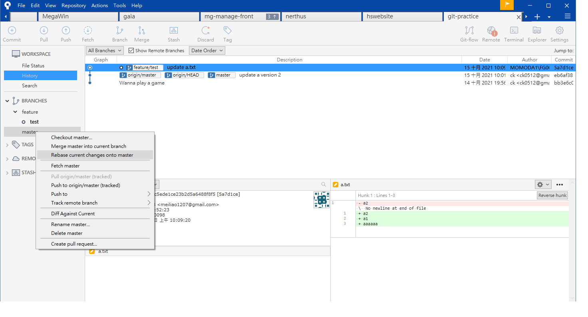
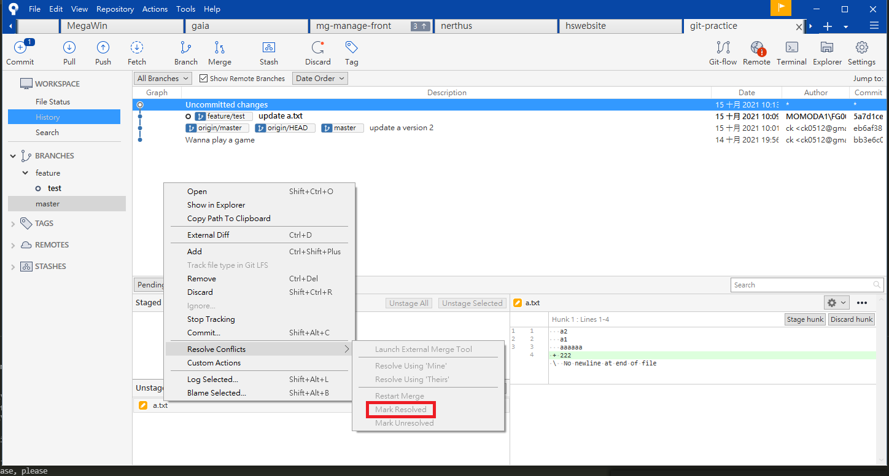

# Sourcetree - git 的GUI 管理軟體
###### tags: `sourcetree`

- 參考
 - [用 Sourcetree 實現基礎版本管控](https://medium.com/samumu-clan/%E7%94%A8-sourcetree-%E5%AF%A6%E7%8F%BE%E5%9F%BA%E7%A4%8E%E7%89%88%E6%9C%AC%E7%AE%A1%E6%8E%A7-b007254e95c5)

我自己一般都是用command line，應映公司都用sourcetree紀錄一下常見的問題 其他可以自己到參考去看

### 安裝
[Sourcetree 的下載點](https://www.sourcetreeapp.com/)

### 新建專案
下載後，初次使用必須先按下[New Respostory]，將想做 Git 的專案加入到 Sourcetree 中

### 一般用法
1. 切到自己分支(點一下確認)
2. pull master
3. 有變更rebase master(如圖)

4. 解衝突(如圖)

### Stash方法
1. 先右上+ 點專案進去
2. 看有沒有衝突
3. 有衝突的話先stash起來
4. forse push 
5. pull最新進度 apply回來
6. 看history
