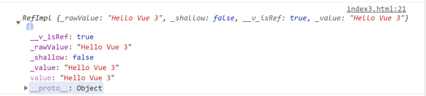

# Vue3 筆記
###### tags: `Vuejs`, `Vue3`, `base intro`

## Vue3優點
 - 使用`composition API`模式編程(Composition API 只是 Vue3 中另一種編寫組件的方法 ，在 Vue3 中仍然可使用 Vue2 編寫組件的方法)
 - 提供更好的 TypeScript 支持
 - 組件太大，需要依功能分類時可使用
 - 需要跨組件使用程式碼

## 基本介紹
 - 預設沒有雙向綁定, 必須藉由`const { ref } = Vue;` 取得 Vue 的 ref 方法
 - 所有程式碼包含function皆包在`setup()`函數裡, `setup()` 會在 `Components`, `Props`, `Data`, `Methods`, `Computed Properties` 和 `Lifecycle Methods` 前執行，並且 **不能在其中存取 `this`**
 - 如果在`setup`階段把東西印出來, 會長這樣(需要改變`obj`的`value屬性`才能改變內部的值)
 


## 用ref還是reactive? 
- ref( ) : 可以接受任何型態的資料，但是不會對物件或陣列內部的屬性變動做監聽，取值必須取`obj.value`。
- reactive( ) : 只能接受物件或陣列，可以做深層的監聽，以及取得資料不需要 `.value`，但會變成`proxy物件`。
 > 如果要對`reactive`進行解構附值, 需先用`toRefs`將其轉為普通物件
  - ex:
    ```javascript=
    function useInfo(){
      let sate=reactive({
        name1:"奧特曼",
        age1:1000
      })
      //這裡變成響應式並且解構
      return { ...toRefs(sate) }
    }
    ```


## 生命週期
若想在 setup 中寫在生命週期中執行的程式碼，可以這樣寫：
> 在 setup 中無法使用 beforeCreate 及 created，是因為 setup 是在 beforeCreate 後立即被呼叫，created 則在 setup 之後，可以直接將程式碼寫在相對的生命週期

```javascript=
const { onBeforeMount, onMounted } = Vue;
const App = {
  setup() {
    onBeforeMount(() => { 
      console.log("Before Mount!");
    });
    onMounted(() => {
      console.log("Mounted!");
    });
};
```

## 核心功能`setup()`
  - 接受兩個參數`props`及`context`
    - `props`: 
      1. `setup函數`中的`props`是響應式的，當傳入新的 prop 時，它將被更新。 
      2. 不能使用ES6解構，因為**它會消除 prop 的響應性**。
      3. 如果需要解構`props`，請使用`toRefs`
    - `context`: 
      1. `context`是一個普通的 JavaScript 對象，它暴露三個組件的 property( attrs, slots, emit)：
      2. 非響應式因此可以使用ES6解構
      3. `attrs`和`slots`是有狀態的對象，它們總是會隨組件本身的更新而更新。這意味著你應該避免對它們進行解構，並始終以`attrs.x`或`slots.x`的方式引用。
      4. 請注意，`attrs`和`slots`是非響應式的。如果你打算根據attrs或slots更改應用副作用，那麼應該在onUpdated生命週期鉤子中執行此操作。
  - 因為實例尚未被創建，因此在setup裡無法使用`data`、`computed`及`methods`
  - 在setup裡返回的`refs`是會自動解開的，因此不須在模板中使用`.value`
  - 在setup裡沒有`this`

## 實際操作

1. 一般寫法

```javascript=
const app = {
  setup() {
    const msg = ref(`hello Vue3`);
    function addTextToMsg() {
      return msg.value += '!'
    }
    
    const countMsgLength = computed(function() {
      return msg.value.length || 0; 
    })
    
    return {
      msg,
      addTextToMsg,
      countMsgLength
    };
  }
}

Vue.createApp(app).mount('#app')
```

2. 多函式寫法 函式太多的時候，很難辨別模板中的物件來自於哪個函式

```javascript=
const app = {
  setup() {
    return {
      ...todoListFunction(),
      ...helloVueFunction()
    };
  }
};

function todoListFunction() {
  const todos = ref([
    'buy apple',
    'learn Vue3',
    'drink water',
  ]);
  
  return {
    todos
  }
}

function helloVueFunction() {
  const msg = ref('hello Vue3');
  const countMsgLength = computed(function() {
    return msg.value.length || 0;
  })
  
  function addTextToMsg(text) {
    return msg.value += text
  }
  
  return {
    msg,
    countMsgLength,
    addTextToMsg,
  }
}

Vue.createApp(app).mount('#app')
```

3. 可以改成這樣

```javascript=
const app = {
  setup() {
    const {
      msg,
      countMsgLength,
      addTextToMsg
    } = helloVueFunction();
    
    const { todos } = todoListFunction();
    
    return {
      msg,
      countMsgLength,
      addTextToMsg,
      todos
    }
  }
}

function todoListFunction() {
  const todos = ref([
    'buy apple',
    'learn Vue3',
    'drink water',
  ]);
  
  return {
    todos
  }
}

function helloVueFunction() {
  const msg = ref('hello Vue3');
  const countMsgLength = computed(function() {
    return msg.value.length || 0;
  })
  
  function addTextToMsg(text) {
    return msg.value += text
  }
  
  return {
    msg,
    countMsgLength,
    addTextToMsg,
  }
}

Vue.createApp(app).mount('#app')
```